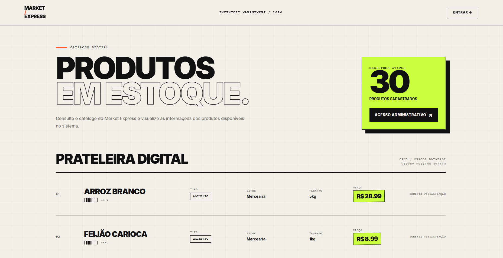
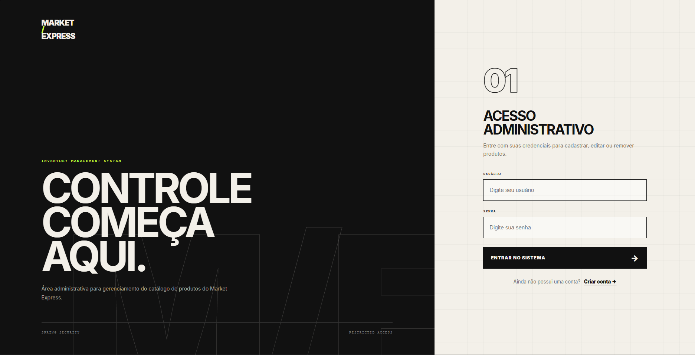
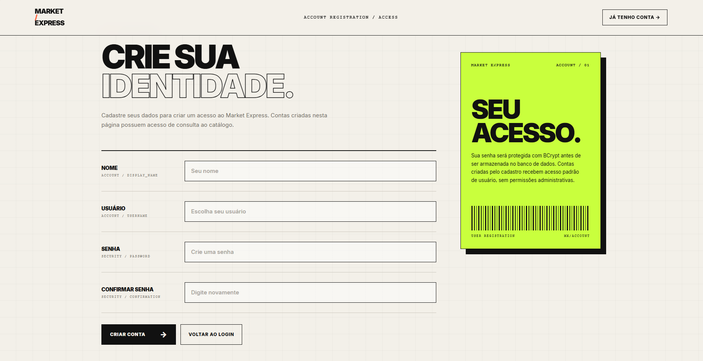
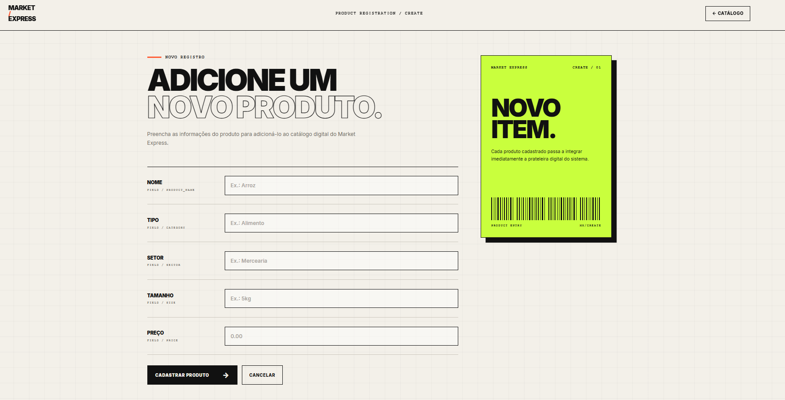
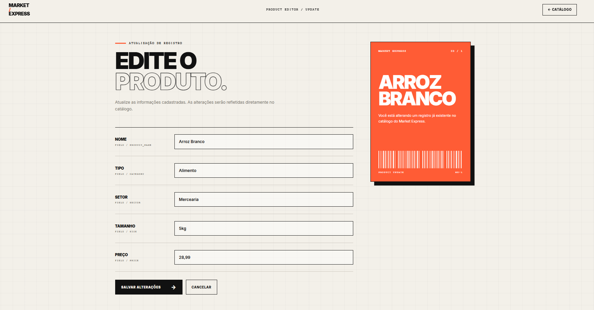
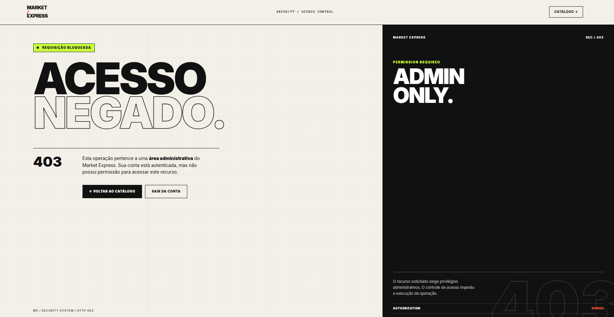
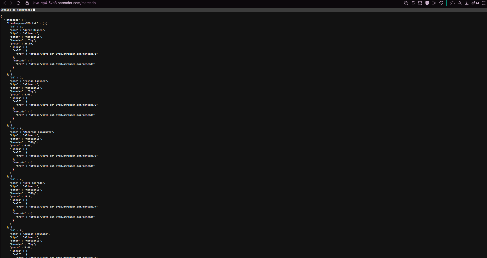
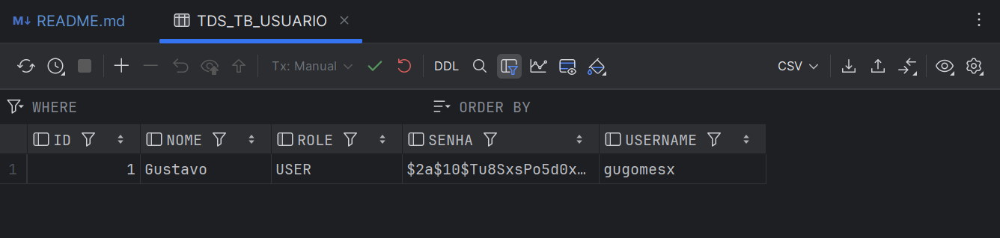
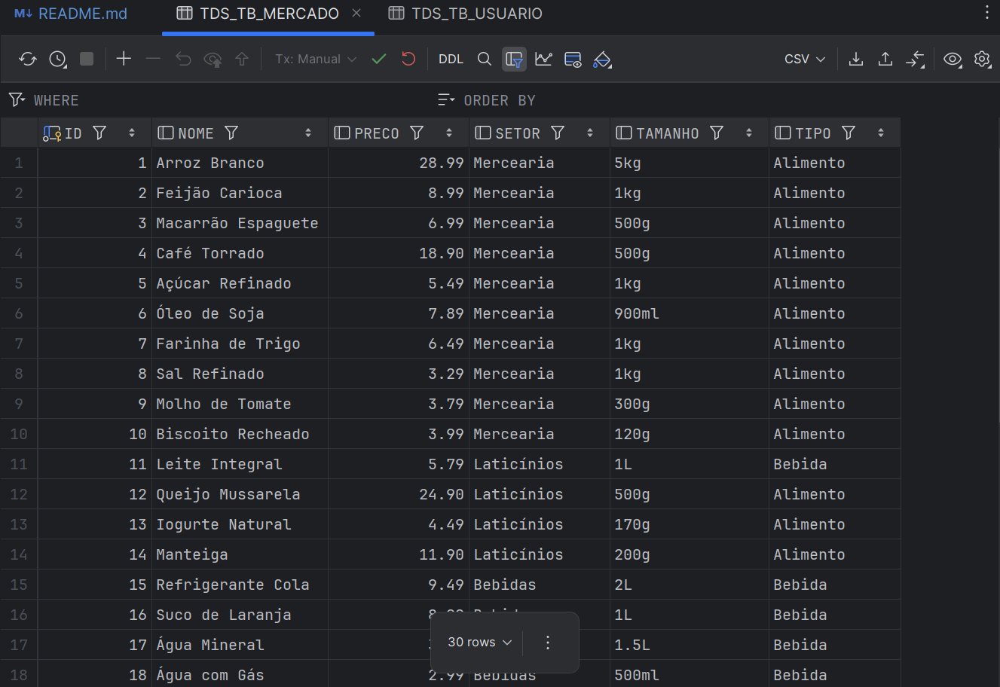
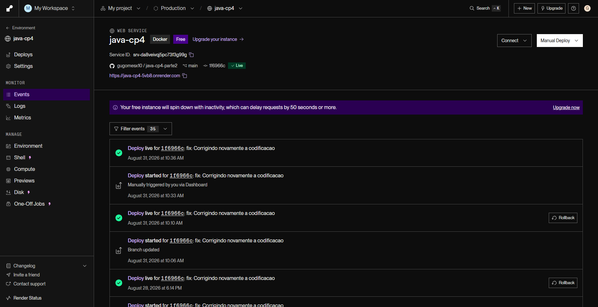

# Market Express

Aplicação web desenvolvida para o **Checkpoint 4 - Parte II** da FIAP.

O projeto permite visualizar e gerenciar produtos de um mercado utilizando **Spring Boot, Spring MVC, Thymeleaf, Spring Security e Oracle Database**, mantendo também a API REST com HATEOAS desenvolvida na Parte I.

---

## Deploy

Aplicação publicada no **Render**:

- **Sistema:** https://java-cp4-5vb8.onrender.com/itens
- **Login:** https://java-cp4-5vb8.onrender.com/login
- **API REST:** https://java-cp4-5vb8.onrender.com/mercado

> No primeiro acesso, o Render pode levar alguns segundos para inicializar a aplicação.

---

## Funcionalidades

- Catálogo público de produtos
- Cadastro de usuários
- Login e logout
- Controle de acesso por perfil
- CRUD de produtos
- Persistência com Oracle Database
- Interface web com Thymeleaf
- API REST
- HATEOAS
- Deploy com Docker e Render

### Perfis de acesso

| Perfil | Visualizar | Cadastrar | Editar | Excluir |
|---|:---:|:---:|:---:|:---:|
| Visitante | ✅ | ❌ | ❌ | ❌ |
| USER | ✅ | ❌ | ❌ | ❌ |
| ADMIN | ✅ | ✅ | ✅ | ✅ |

Usuários cadastrados pelo sistema recebem automaticamente o perfil `USER`.

As operações de criação, edição e exclusão são restritas ao perfil `ADMIN`.

---

## Tecnologias

- Java 17
- Spring Boot
- Spring MVC
- Spring Security
- Spring Data JPA
- Spring HATEOAS
- Thymeleaf
- Hibernate
- Oracle Database
- Lombok
- Maven
- Docker
- Render
- Postman
- Git / GitHub
- IntelliJ IDEA

---

## Arquitetura

O projeto utiliza separação de responsabilidades em camadas:

```text
Controller
    ↓
Service
    ↓
Repository
    ↓
Oracle Database
```

Estrutura principal:

```text
src/main/java/br/com/fiap/market

├── config
├── controller
├── dto
├── entity
├── repository
├── service
└── MarketApplication.java
```

---

## Interface Web

Principais rotas MVC:

| Método | Endpoint | Acesso | Descrição |
|---|---|---|---|
| GET | `/itens` | Público | Lista os produtos |
| GET | `/itens/novo` | ADMIN | Formulário de cadastro |
| POST | `/itens` | ADMIN | Cadastra produto |
| GET | `/itens/{id}/editar` | ADMIN | Formulário de edição |
| PUT | `/itens/{id}/editar` | ADMIN | Atualiza produto |
| DELETE | `/itens/{id}/excluir` | ADMIN | Exclui produto |
| GET | `/login` | Público | Tela de login |
| GET | `/cadastro` | Público | Cadastro de usuário |
| POST | `/cadastro` | Público | Registra usuário |

---

## API REST

A API desenvolvida na Parte I foi mantida.

| Método | Endpoint | Descrição |
|---|---|---|
| GET | `/mercado` | Lista os produtos |
| GET | `/mercado/{id}` | Busca produto por ID |
| POST | `/mercado` | Cadastra produto |
| PUT | `/mercado/{id}` | Atualização completa |
| PATCH | `/mercado/{id}` | Atualização parcial |
| DELETE | `/mercado/{id}` | Exclui produto |

Exemplo de resposta:

```json
{
  "id": 1,
  "nome": "Arroz Branco",
  "tipo": "Alimento",
  "setor": "Mercearia",
  "tamanho": "5kg",
  "preco": 28.99,
  "_links": {
    "self": {
      "href": "/mercado/1"
    },
    "mercado": {
      "href": "/mercado"
    }
  }
}
```

As respostas da API utilizam **Spring HATEOAS**, adicionando links relacionados aos recursos disponíveis.

---

## Banco de Dados

A aplicação utiliza **Oracle Database** com Spring Data JPA e Hibernate.

Principais tabelas:

```text
TDS_TB_MERCADO
TDS_TB_USUARIO
```

A interface web e a API REST utilizam os mesmos dados persistidos no banco.

---

## Segurança

A autenticação e autorização são realizadas com **Spring Security**.

- O catálogo pode ser acessado sem autenticação
- Usuários `USER` possuem acesso somente à visualização
- Usuários `ADMIN` possuem acesso ao CRUD
- Senhas de usuários são armazenadas utilizando BCrypt
- Rotas administrativas são protegidas no backend
- Credenciais sensíveis não ficam armazenadas diretamente no repositório

As configurações utilizam variáveis de ambiente:

```properties
spring.datasource.url=${SPRING_DATASOURCE_URL}
spring.datasource.username=${SPRING_DATASOURCE_USERNAME}
spring.datasource.password=${SPRING_DATASOURCE_PASSWORD}

app.admin.username=${ADMIN_USERNAME:admin}
app.admin.password=${ADMIN_PASSWORD}
```

---

## Executando Localmente

Configure as seguintes variáveis de ambiente:

```text
SPRING_DATASOURCE_URL
SPRING_DATASOURCE_USERNAME
SPRING_DATASOURCE_PASSWORD
ADMIN_USERNAME
ADMIN_PASSWORD
```

Execute:

```bash
mvn spring-boot:run
```

A aplicação ficará disponível em:

```text
http://localhost:8082/itens
```

API REST:

```text
http://localhost:8082/mercado
```

---

## Deploy

A aplicação foi containerizada utilizando **Docker** e publicada no **Render**.

Fluxo do deploy:

```text
GitHub
   ↓
Docker
   ↓
Render
   ↓
Spring Boot
   ↓
Oracle Database
```

As credenciais utilizadas em produção são configuradas através das variáveis de ambiente do Render.

---

## Evidências

### Catálogo



### Login



### Cadastro de Usuário



### Área Administrativa


### Cadastro de Produto



### Edição de Produto



### Acesso Negado



### API REST



### Banco de Dados





### Deploy no Render



---

## Spring Initializr

Configuração utilizada:

```text
Project: Maven
Language: Java
Packaging: Jar
Java: 17
```

Principais dependências:

```text
Spring Web
Spring Data JPA
Spring Security
Thymeleaf
Spring HATEOAS
Lombok
Oracle Driver
```

## Testes

Foram realizados testes das principais funcionalidades:

- CRUD de produtos
- Persistência no Oracle
- Cadastro de usuários
- Login e logout
- Permissões `USER` e `ADMIN`
- Proteção das rotas administrativas
- API REST
- HATEOAS
- Deploy no Render

---

## Integrantes

| Nome | RM |
|---|---|
| Gustavo Gomes Martins | RM555999 |
| Matheus de Mattos Vecchi | RM561716 |
| Nicholas Albuquerque Buzo | RM561082 |
| Nicholas Camillo Canadas de Paula | RM561262 |

---

## Informações Acadêmicas

- **Instituição:** FIAP
- **Curso:** Tecnologia em Análise e Desenvolvimento de Sistemas
- **Checkpoint:** CP4
- **Parte:** Parte II
- **Professor:** Dr. Marcel Stefan Wagner
- **IDE:** IntelliJ IDEA

---

## Conclusão

O Market Express evoluiu de uma API REST para uma aplicação web utilizando **Spring MVC, Thymeleaf e Spring Security**.

O sistema possui persistência com **Oracle Database**, controle de acesso por perfil, API REST com **HATEOAS** e deploy utilizando **Docker e Render**.